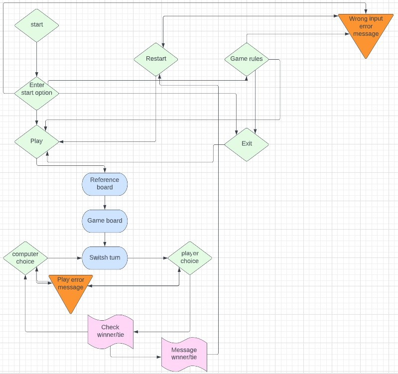

# TIC TAC TOE GAME

Tic tac toe game is a classic three in a row game that is also usually played with pen and paper.
You can read more about it in [Wikipedia](https://en.wikipedia.org/wiki/Tic-tac-toe)
In this game you play against the computer whoever gets three in a row wins. 

[Here](https://tic-tac-toe-game-python.herokuapp.com/?fbclid=IwAR3vCA1AoyU9nDad_jioKuAjqZCTV-8yYd-x1KAHFBb_rFpIQXLTJNcUSK0) is the live link to my python game, which runs in the Code Institute mock terminal on Heroku.

## How the game works

The player is welcomed to the game. And is asked if it wants to play, read the game rules, or exit.

If the player selects game rules, the game rules will come up. And the player can choose whether to play or exit the game.

If the player chooses to exit the game, the player will receive a thank you message. And the player can choose whether to play.

If the player chooses to play, a reference board will appear showing which number belongs to the box. And below that, an empty game board appears, with a text showing who the player and the computer are. And the player gets to start choosing a square.

The player and the computer take turns choosing a free square until someone wins or until there is a tie.

The player can choose to play as many times as they want. And whoever lost the round gets to start the next game round.

## Game flow chart

To understand how the game works. Created in [Lucid](https://lucid.app/lucidchart/eb289532-1f80-4e71-8b0f-16fa9bfdbac1/edit?invitationId=inv_bd327f40-8cdc-449b-bb8e-2e85c2ac9540&page=0_0#)

## UX 

### The game creator's goal

- __Provide users with entertainment__

| Users goal | How the creator fulfills this
----|----
Play tic tac toe against the computer | Make a tic tac toe game you can play against the computer |
Easy to navigate | Good navigation possibilities
Simple to understand | Good explanations in the right place 

