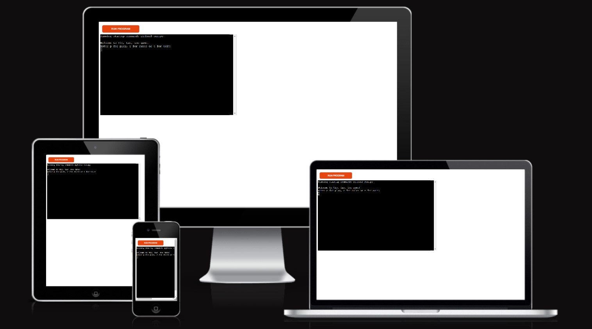
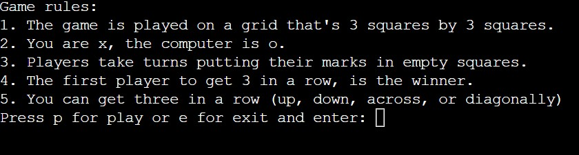
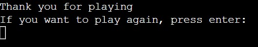
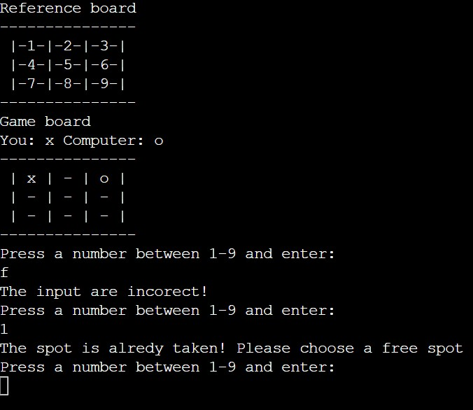
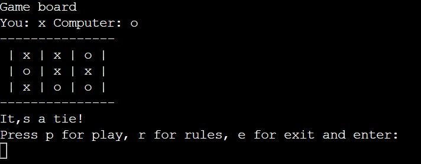
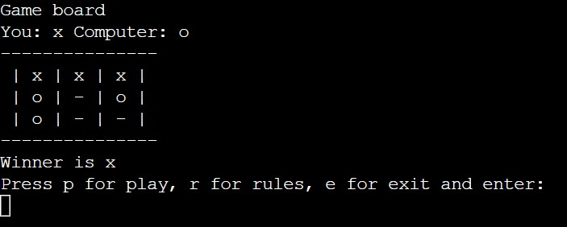

# TIC TAC TOE GAME

Tic tac toe game is a classic three in a row game that is also usually played with pen and paper.
You can read more about it in [Wikipedia](https://en.wikipedia.org/wiki/Tic-tac-toe)
In this game you play against the computer whoever gets three in a row wins. 

[Here](https://tic-tac-toe-game-python.herokuapp.com/?fbclid=IwAR3vCA1AoyU9nDad_jioKuAjqZCTV-8yYd-x1KAHFBb_rFpIQXLTJNcUSK0) is the live link to my python game, which runs in the Code Institute mock terminal on Heroku.

## Game flow chart

To understand how the game works. Created in [Lucid](https://lucid.app/lucidchart/eb289532-1f80-4e71-8b0f-16fa9bfdbac1/edit?invitationId=inv_bd327f40-8cdc-449b-bb8e-2e85c2ac9540&page=0_0#)

## UX 

| Users goal | How the creator fulfills this
----|----
Play tic tac toe against the computer | Make a tic tac toe game you can play against the computer |
Easy to navigate | Good navigation possibilities
Simple to understand | Good explanations in the right place 

## Features

### How the game works

- __The player is welcomed to the game. And is asked if it wants to play, read the game rules, or exit.__
- __This is clear and easy to understand, which facilitates ease of use__

- __If the player selects game rules, the game rules will come up. And the player can choose whether to play or exit the game.__
- __The game rules and options are easy to read and understand. This facilitates ease of use.__

- __If the player chooses to exit the game, the player will receive a thank you message. And the player can choose whether to play.__
- __The message and option are easy to read and understand. This facilitates ease of use.__

- __If the player chooses to play, a reference board will appear showing which number belongs to the box. And below that, an empty game board appears, with a text showing who the player and the computer are. And the player gets to start choosing a square.__
- __This gives the user a quick overview and understanding of how the game works__

- __When the user presses a sign or a number outside 1-9, a message is displayed "The input are incorect!"__
- __When the user selects a number that is already taken, a message is displayed "The spot is alredy taken! Please enter a free spot"__
- __This helps the user quickly understand what is wrong__

- __The player and the computer take turns choosing a free square until someone wins or until there is a tie.__
- __The screen is cleared and all that remains is the game board and message with the result. And navigation options.__
- __A clean screen with only the most necessary information. Make the game easier to use__

- __The player and the computer take turns choosing a free square until someone wins or until there is a tie.__
- __The player can choose to play as many times as they want. And whoever lost the round gets to start the next game round.__

### Features I want to add

- __Restart option when the game is running__
- __Option to play 2 players against each other__

## Testing

I have tested this game through the following steps:

- __I have tested that everything works on different browsers: Chrome, Edge, and Firefox__
- __I have asked family and friends to test the game and see if it works__
- __I have tested it in my local terminal and in the  Code Institute mock terminal on Heroku.__

### Bugs

- __My restart function didn't work because I called it above where it was written. I solved this by moving it to the top.__
- __I got an error message on my Docstring comments because there were indentation errors in several places in the rest of the code. I solved this by going through the entire code line by line and fixing the indents.__
  
  - __Unfixed Bugs__

  - None that I know of

## Validator Testing

- __pep8online__

  - The code did not give any error messages in [pep8online](http://pep8online.com/checkresult)

## Deployment

### To deploy this page to Heroku the following steps have been followed:

- __Go to [Heroku](https://dashboard.heroku.com/apps/sandwiche/deploy/github). __
- __Create an account or log in if you have already registered.__
- __Click on New and select Create new app from the drop-down menu.__
- __Enter your app name. The app name must be unique to be approved. After that select your region.__
- __Click on Create app.__
- __Click settings and scroll down to Config vars.__
- __Click on Reveal config vars and type PORT in KEY and type 8000 the value field Click the Add button.__
- __Scroll down to Buildpacks. And click the Add buildpack and select python and node.js. You can only choose one at a time and python must come before node.js. If python is not first, just click and drag it to the top and save.__
- __click on the deploy tab. And scroll down and select gitHub as deployment.__
- __Connect your github account, confirm and proceed.__
- __Search for and select your repository name and connect.__
- __When it's done and successfully connected, select how you want to push updates from the following options:__
  - Use Automatic deploys if you would like a new build when changes are pushed to GitHub from Gitpod.
  - Use Manual deploy for a new build every time this button is clicked.
  - Select a branch to deploy and press deploy branch.
  - Your app was successfully deployed.
  - Click View.

